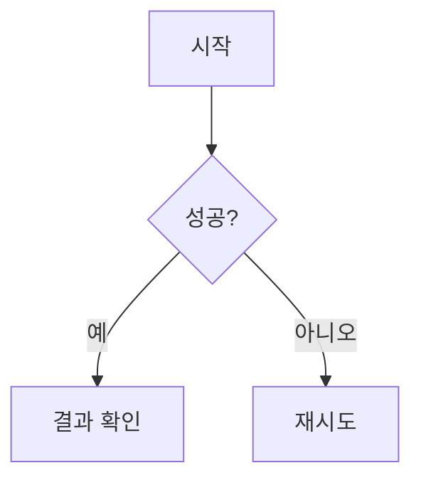

## 1. 텍스트와 기본 문법
본문은 일반적인 마크다운 형식을 따릅니다. **굵게**, *기울임*, ~~취소선~~ 등을 자유롭게 사용하세요.

> **Tip:** 중요한 내용은 인용구를 활용하면 눈에 잘 띕니다.

---

## 2. 이미지 추가 (가운데 정렬 및 캡션)
이미지는 `assets/img/` 폴더에 넣고 아래 형식을 권장합니다.

{: .normal }
_이미지 아래에 설명을 적으면 캡션이 됩니다._

- `.normal`: 원본 크기 유지 (Chirpy 특화 속성)
- `.light`, `.dark`: 특정 모드(라이트/다크)에서만 보이게 설정 가능


---

## 3. 수학 공식 (LaTeX)
`math: true` 설정 시 사용 가능합니다.

- **문장 안의 공식**: $E = mc^2$
- **독립 줄 공식**:
$$\sum_{i=1}^{n} i = \frac{n(n+1)}{2}$$

---

## 4. 다이어그램 (Mermaid)
`mermaid: true` 설정 시 간단한 코드로 차트를 그릴 수 있습니다.



---

## 5. 코드 블록 및 하이라이트
언어를 지정하면 문법 하이라이트가 적용됩니다.

```python
def hello_chirpy():
    print("Hello, Jekyll!")
```

---

## 6. 알림창 (Prompt)
Chirpy에서 제공하는 특수 스타일입니다.

> {: .prompt-info }
> **정보**: 유용한 정보를 전달할 때 사용합니다.

> {: .prompt-tip }
> **팁**: 꿀팁을 알려줄 때 사용합니다.

> {: .prompt-warning }
> **경고**: 주의사항을 알릴 때 사용합니다.

> {: .prompt-danger }
> **위험**: 치명적인 문제를 경고할 때 사용합니다.
